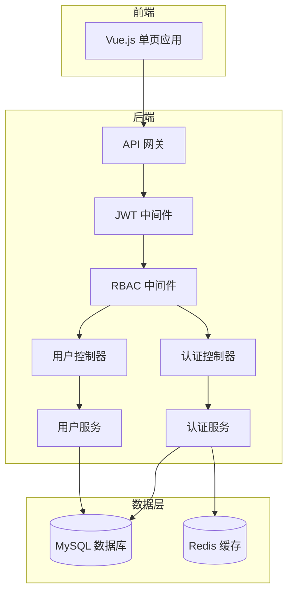

# 设计文档：用户认证模块

## 概述

用户认证模块是医院门诊预约挂号系统的基础设施，负责处理多角色用户（患者、医师、管理员）的注册、登录、权限控制和个人信息管理。系统采用 JWT 进行无状态身份认证，使用 BCrypt 进行密码加密，实现基于角色的访问控制（RBAC）。

## 架构设计



### 技术栈

- **前端**: Vue 3 + Vite + Pinia (状态管理) + Vue Router
- **后端**: Node.js + Express / Spring Boot
- **数据库**: MySQL 8.0
- **缓存**: Redis (会话管理、验证码存储)
- **认证**: JWT (JSON Web Token)
- **加密**: BCrypt (密码哈希)

## 组件和接口

### 1. 认证控制器 (AuthController)

```typescript
interface AuthController {
  // 患者注册
  registerPatient(req: PatientRegistrationRequest): Promise<RegistrationResponse>;
  
  // 医师注册
  registerDoctor(req: DoctorRegistrationRequest): Promise<RegistrationResponse>;
  
  // 用户登录
  login(req: LoginRequest): Promise<LoginResponse>;
  
  // 用户登出
  logout(req: AuthenticatedRequest): Promise<void>;
  
  // 刷新令牌
  refreshToken(req: RefreshTokenRequest): Promise<TokenResponse>;
  
  // 发送密码重置验证码
  sendResetCode(req: ResetCodeRequest): Promise<void>;
  
  // 重置密码
  resetPassword(req: ResetPasswordRequest): Promise<void>;
}
```

### 2. 用户控制器 (UserController)

```typescript
interface UserController {
  // 获取当前用户信息
  getProfile(req: AuthenticatedRequest): Promise<UserProfile>;
  
  // 更新用户信息
  updateProfile(req: UpdateProfileRequest): Promise<UserProfile>;
  
  // 修改密码
  changePassword(req: ChangePasswordRequest): Promise<void>;
  
  // 管理员：获取用户列表
  listUsers(req: AdminRequest): Promise<PaginatedUsers>;
  
  // 管理员：审批医师注册
  approveDoctor(req: ApproveDoctorRequest): Promise<void>;
  
  // 管理员：禁用/启用用户
  toggleUserStatus(req: ToggleStatusRequest): Promise<void>;
}
```

### 3. 认证服务 (AuthService)

```typescript
interface AuthService {
  // 验证用户凭证
  validateCredentials(identifier: string, password: string): Promise<User | null>;
  
  // 生成 JWT 令牌
  generateToken(user: User): TokenPair;
  
  // 验证 JWT 令牌
  verifyToken(token: string): TokenPayload | null;
  
  // 检查账户锁定状态
  checkAccountLock(userId: string): Promise<boolean>;
  
  // 记录登录失败
  recordLoginFailure(identifier: string): Promise<number>;
  
  // 清除登录失败记录
  clearLoginFailures(identifier: string): Promise<void>;
  
  // 生成验证码
  generateVerificationCode(phone: string): Promise<string>;
  
  // 验证验证码
  verifyCode(phone: string, code: string): Promise<boolean>;
}
```

### 4. JWT 中间件

```typescript
interface JWTMiddleware {
  // 验证请求中的 JWT 令牌
  authenticate(req: Request, res: Response, next: NextFunction): void;
  
  // 可选认证（允许未登录访问）
  optionalAuth(req: Request, res: Response, next: NextFunction): void;
}
```

### 5. RBAC 中间件

```typescript
interface RBACMiddleware {
  // 检查用户角色权限
  requireRole(...roles: UserRole[]): MiddlewareFunction;
  
  // 检查资源所有权
  requireOwnership(resourceType: string): MiddlewareFunction;
}
```

## 数据模型

### 用户表 (users)

```sql
CREATE TABLE users (
  id VARCHAR(36) PRIMARY KEY,
  phone VARCHAR(20) UNIQUE NOT NULL,
  password_hash VARCHAR(255) NOT NULL,
  role ENUM('patient', 'doctor', 'admin') NOT NULL,
  status ENUM('active', 'pending', 'locked', 'disabled') DEFAULT 'active',
  login_failures INT DEFAULT 0,
  locked_until DATETIME NULL,
  created_at DATETIME DEFAULT CURRENT_TIMESTAMP,
  updated_at DATETIME DEFAULT CURRENT_TIMESTAMP ON UPDATE CURRENT_TIMESTAMP
);
```

### 患者表 (patients)

```sql
CREATE TABLE patients (
  id VARCHAR(36) PRIMARY KEY,
  user_id VARCHAR(36) UNIQUE NOT NULL,
  name VARCHAR(50) NOT NULL,
  id_card VARCHAR(18) UNIQUE NOT NULL,
  gender ENUM('male', 'female') NOT NULL,
  birth_date DATE NOT NULL,
  medical_history TEXT,
  allergy_history TEXT,
  emergency_contact VARCHAR(50),
  emergency_phone VARCHAR(20),
  FOREIGN KEY (user_id) REFERENCES users(id) ON DELETE CASCADE
);
```

### 医师表 (doctors)

```sql
CREATE TABLE doctors (
  id VARCHAR(36) PRIMARY KEY,
  user_id VARCHAR(36) UNIQUE NOT NULL,
  name VARCHAR(50) NOT NULL,
  employee_id VARCHAR(20) UNIQUE NOT NULL,
  title ENUM('resident', 'attending', 'associate_chief', 'chief') NOT NULL,
  department_id VARCHAR(36) NOT NULL,
  specialty TEXT,
  license_number VARCHAR(50) UNIQUE NOT NULL,
  introduction TEXT,
  avatar_url VARCHAR(255),
  approved_at DATETIME NULL,
  approved_by VARCHAR(36) NULL,
  FOREIGN KEY (user_id) REFERENCES users(id) ON DELETE CASCADE
);
```

### 管理员表 (admins)

```sql
CREATE TABLE admins (
  id VARCHAR(36) PRIMARY KEY,
  user_id VARCHAR(36) UNIQUE NOT NULL,
  name VARCHAR(50) NOT NULL,
  employee_id VARCHAR(20) UNIQUE NOT NULL,
  FOREIGN KEY (user_id) REFERENCES users(id) ON DELETE CASCADE
);
```

### TypeScript 类型定义

```typescript
enum UserRole {
  PATIENT = 'patient',
  DOCTOR = 'doctor',
  ADMIN = 'admin'
}

enum UserStatus {
  ACTIVE = 'active',
  PENDING = 'pending',
  LOCKED = 'locked',
  DISABLED = 'disabled'
}

interface User {
  id: string;
  phone: string;
  passwordHash: string;
  role: UserRole;
  status: UserStatus;
  loginFailures: number;
  lockedUntil: Date | null;
  createdAt: Date;
  updatedAt: Date;
}

interface Patient {
  id: string;
  userId: string;
  name: string;
  idCard: string;
  gender: 'male' | 'female';
  birthDate: Date;
  medicalHistory: string | null;
  allergyHistory: string | null;
  emergencyContact: string | null;
  emergencyPhone: string | null;
}

interface Doctor {
  id: string;
  userId: string;
  name: string;
  employeeId: string;
  title: 'resident' | 'attending' | 'associate_chief' | 'chief';
  departmentId: string;
  specialty: string | null;
  licenseNumber: string;
  introduction: string | null;
  avatarUrl: string | null;
  approvedAt: Date | null;
  approvedBy: string | null;
}

interface TokenPayload {
  userId: string;
  role: UserRole;
  exp: number;
  iat: number;
}

interface TokenPair {
  accessToken: string;
  refreshToken: string;
  expiresIn: number;
}
```

## 正确性属性

*属性是指在系统所有有效执行中都应保持为真的特征或行为——本质上是关于系统应该做什么的形式化陈述。属性是人类可读规范与机器可验证正确性保证之间的桥梁。*

### 属性 1: 有效患者注册创建账户
*对于任意*有效的患者注册数据（有效姓名、有效身份证格式、有效手机号格式），提交注册后系统应创建状态为 'active' 的新患者账户。
**验证需求: 1.1**

### 属性 2: 重复身份证拒绝
*对于任意*身份证号已存在于系统中的患者注册，系统应拒绝注册并返回相应的错误信息。
**验证需求: 1.2**

### 属性 3: 无效输入验证
*对于任意*包含无效格式数据（无效手机号、无效身份证格式、无效资格证号）的注册请求，系统应拒绝请求并返回验证错误。
**验证需求: 1.3, 1.4, 2.3**

### 属性 4: 必填字段验证
*对于任意*缺少必填字段的注册请求，系统应拒绝请求并标识缺失的字段。
**验证需求: 1.5**

### 属性 5: 医师注册创建待审批账户
*对于任意*有效的医师注册数据，提交注册后系统应创建状态为 'pending' 的新医师账户。
**验证需求: 2.1**

### 属性 6: 医师审批激活账户
*对于任意*待审批的医师账户，当管理员审批通过后，账户状态应变更为 'active'。
**验证需求: 2.4**

### 属性 7: 有效凭证返回包含正确角色的 JWT
*对于任意*拥有有效凭证的用户，登录后系统应返回包含正确用户 ID 和角色的 JWT 令牌。
**验证需求: 3.1**

### 属性 8: 无效凭证拒绝
*对于任意*密码错误的登录尝试，系统应拒绝该尝试并增加失败计数器。
**验证需求: 3.2**

### 属性 9: 受保护请求的 JWT 验证
*对于任意*访问受保护端点的请求，如果 JWT 令牌有效且未过期，请求应被处理；如果无效或过期，请求应被拒绝并返回 401 状态。
**验证需求: 3.4, 3.5**

### 属性 10: 资料获取返回角色对应数据
*对于任意*请求其个人资料的已认证用户，系统应返回与其角色对应的完整资料数据（患者返回患者信息，医师返回医师信息）。
**验证需求: 4.1**

### 属性 11: 资料更新持久化
*对于任意*有效的资料更新请求，更改应被持久化并在后续资料请求中可获取。
**验证需求: 4.2**

### 属性 12: 受保护字段不可修改
*对于任意*尝试修改受保护字段（身份证、工号）的资料更新请求，系统应拒绝更新。
**验证需求: 4.3**

### 属性 13: 密码修改往返测试
*对于任意*成功的密码修改，用户应能使用新密码登录，且不能使用旧密码登录。
**验证需求: 4.4**

### 属性 14: 密码强度验证
*对于任意*不符合强度要求的密码（少于 8 个字符、缺少字母或缺少数字），系统应拒绝密码修改。
**验证需求: 4.5**

### 属性 15: RBAC 权限验证
*对于任意*访问角色受限端点的已认证请求，如果用户角色不在允许的角色列表中，系统应返回 403 禁止访问。
**验证需求: 5.1, 5.2, 5.3, 5.4**

### 属性 16: 验证码有效性
*对于任意*密码重置验证码，仅当验证码与生成的验证码匹配且在生成后 5 分钟内提交时，验证码才应被接受。
**验证需求: 6.1, 6.2, 6.3**

### 属性 17: 密码重置使会话失效
*对于任意*成功的密码重置，该用户的所有现有 JWT 令牌应变为无效。
**验证需求: 6.4**

## 错误处理

### 认证错误

| 错误码 | HTTP 状态 | 描述 |
|--------|-----------|------|
| AUTH_001 | 401 | 凭证无效 |
| AUTH_002 | 401 | 令牌已过期 |
| AUTH_003 | 401 | 令牌无效 |
| AUTH_004 | 403 | 账户已锁定 |
| AUTH_005 | 403 | 账户待审批 |
| AUTH_006 | 403 | 账户已禁用 |
| AUTH_007 | 403 | 权限不足 |

### 注册错误

| 错误码 | HTTP 状态 | 描述 |
|--------|-----------|------|
| REG_001 | 400 | 手机号格式无效 |
| REG_002 | 400 | 身份证格式无效 |
| REG_003 | 400 | 资格证格式无效 |
| REG_004 | 409 | 手机号已注册 |
| REG_005 | 409 | 身份证已注册 |
| REG_006 | 409 | 工号已注册 |
| REG_007 | 400 | 缺少必填字段 |

### 密码错误

| 错误码 | HTTP 状态 | 描述 |
|--------|-----------|------|
| PWD_001 | 400 | 密码强度不足 |
| PWD_002 | 400 | 当前密码错误 |
| PWD_003 | 400 | 验证码无效 |
| PWD_004 | 400 | 验证码已过期 |

## 测试策略

### 属性测试

使用 **fast-check** 库进行属性测试（JavaScript/TypeScript 环境）。

每个属性测试配置运行至少 100 次迭代，使用智能生成器生成测试数据。

```typescript
// 示例：生成器配置
const validPhoneArbitrary = fc.stringMatching(/^1[3-9]\d{9}$/);
const validIdCardArbitrary = fc.stringMatching(/^\d{17}[\dX]$/);
const validPasswordArbitrary = fc.string({ minLength: 8 })
  .filter(s => /[a-zA-Z]/.test(s) && /\d/.test(s));
```

### 单元测试

- 验证各个服务方法的正确性
- 测试边界条件和错误处理
- 使用 Jest 或 Vitest 作为测试框架

### 集成测试

- 测试 API 端点的完整请求/响应流程
- 测试数据库事务的正确性
- 测试 JWT 中间件与 RBAC 中间件的集成

### 测试覆盖率目标

- 单元测试覆盖率 > 80%
- 属性测试覆盖所有核心业务逻辑
- 集成测试覆盖所有 API 端点
